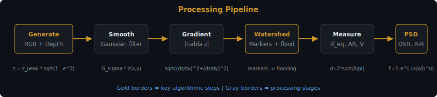
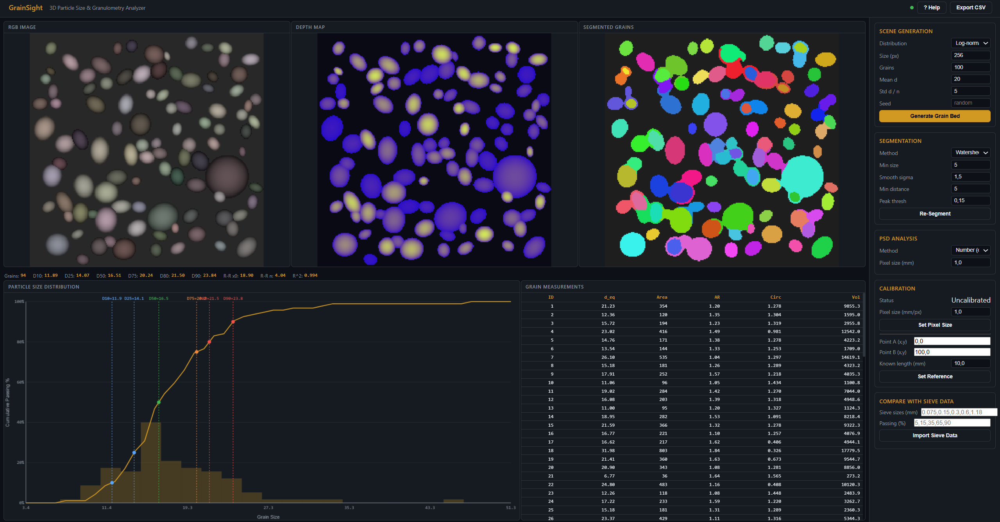
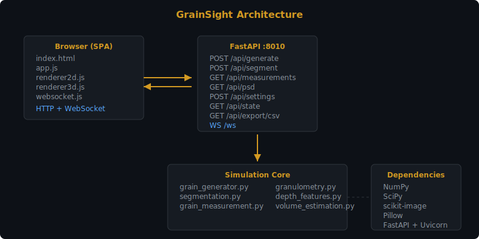

# GrainSight -- 3D Particle Size & Granulometry Analyzer

A web-based application for grain size estimation from RGB-D data using marker-based watershed segmentation, per-grain geometric measurement, and Rosin-Rammler PSD curve fitting. Built with Python/FastAPI on the backend and HTML5 Canvas for interactive browser-based visualization. The system generates synthetic grain beds, segments individual particles, computes 18 morphometric descriptors per grain, and fits particle size distributions with configurable models.

---

## Motivation & Problem

In mining, particle size distribution determines processing efficiency and product quality. Traditional sieve analysis is slow and offline. Image-based granulometry using RGB-D cameras enables real-time, non-contact grain size measurement on conveyor belts.



---

## KPIs — Impact & Value

| KPI | Impact |
|-----|--------|
| Speed | From 4+ hours (physical sieve) → 30 seconds (image analysis) |
| Non-destructive | No material consumed — reusable, continuous monitoring |
| Real-time capable | Conveyor belt online measurement potential |
| Cost reduction | Single RGB-D camera vs $100K+ laser sizer |

## Processing Pipeline


---

## Frontend



---

## Technical Approach — Granulometry Algorithms

### Equivalent Diameter — Comparing Irregular Grains
Real rock fragments are never spherical. To compare on a common scale, we compute the diameter of a circle with the same area (ISO 13322-1):

```
d_eq = 2 · √(A / π)
```

where **A** is the segmented grain area (pixels or mm² if calibrated). A grain with area 314 mm² has d_eq = 20 mm.

### Rosin-Rammler Distribution — Fragmentation Physics
Blast fragmentation produces sizes following the Rosin-Rammler (Weibull) distribution:

```
R(x) = 1 − exp(−(x / x₀)ⁿ)
```

where **x₀** is the characteristic size (63.2% passing) and **n** is the uniformity index. High **n** (>3) = narrow range; low **n** (<1.5) = wide spread. Fitted via curve_fit with n ∈ [0.5, 5].

### Circularity — Shape Characterization
Quantifies how close a grain is to a circle. Crushed rock is angular (C≈0.5), natural gravel is rounded (C≈0.8):

```
C = 4π · A / P²
```

where **A** is area and **P** is perimeter. Perfect circle: C=1. Flaky material: C→0.3.

### Aspect Ratio — Elongation
Measures grain elongation from PCA of the pixel coordinate cloud:

```
AR = major_axis / minor_axis
```

where axes come from eigenvalues of the inertia tensor. AR=1 is equant; AR>2 is elongated. Important for aggregate shape classification (BS EN 933-4).

### 3D Surface Area (Triangle Decomposition)

```
A_3D = Sum  0.5 * |e_1 x e_2|
```

Each depth-map pixel quad is split into two triangles; the cross product of edge vectors yields the true 3D area.

### Depth-Integrated Volume

```
V = Sum (z(i,j) - z_base) * dx * dy
```

where `z_base` is the local background depth and `dx`, `dy` are the calibrated pixel spacings.

---

## Architecture



---

## Features

- **5 synthetic PSD generators**: uniform, normal, log-normal, bimodal, and Rosin-Rammler distributions
- **Marker-based watershed segmentation** on depth gradient magnitude with configurable thresholds
- **18 per-grain geometric descriptors** (ISO 13322-1): equivalent diameter, major/minor axes, aspect ratio, circularity, depth-integrated volume, and more
- **PSD curves**: number-weighted and mass-weighted cumulative distributions
- **D-value extraction**: D10, D25, D50, D75, D80, D90 percentile diameters
- **Rosin-Rammler distribution fitting** with least-squares optimization
- **Sieve analysis simulation** using standard sieve series
- **Pixel-to-mm calibration**: reference object or direct scale entry
- **PSD comparison with ground truth** sieve data (RMSE, KS statistic, D50 error)
- **Depth-integrated volume estimation** per grain from depth map
- **CSV export** of grain measurements for external analysis
- **Real-time web UI** with dark theme, interactive controls, PSD chart, and measurement table
- **WebSocket streaming** for real-time state updates during processing
- **REST API** with full control over generation, segmentation, and analysis parameters

## Project Metrics & Status

| Metric | Status |
|--------|--------|
| Tests | 50 passing |
| Per-grain descriptors | 18 (ISO 13322-1) |
| PSD fitting | Rosin-Rammler with bounded n ∈ [0.5, 5] |
| D-values | D10, D25, D50, D75, D80, D90 |
| Calibration | Reference object or direct pixel_size_mm |
| Comparison | RMSE, KS statistic, D50 relative error vs sieve |

---

## Quick Start

```bash
# Clone and enter the project
cd FASL_3D_GrainSize

# Create and activate virtual environment
python -m venv .venv
source .venv/Scripts/activate    # Windows Git Bash
# source .venv/bin/activate      # Linux / macOS

# Install dependencies
pip install -r requirements.txt

# Run tests
python tests/test_generator.py
python tests/test_segmentation.py
python tests/test_measurement.py
python tests/test_granulometry.py

# Start the application
python run_app.py

# Open http://127.0.0.1:8010 in your browser
```

### Running Tests

```bash
python tests/test_generator.py
python tests/test_segmentation.py
python tests/test_measurement.py
python tests/test_granulometry.py

# Or run all tests
python -m pytest tests/ -v
```

### Building Standalone Executable

```powershell
.\Build_PyInstaller.ps1
```

---

## Project Structure

```
FASL_3D_GrainSize/
├── app/
│   ├── __init__.py
│   ├── main.py                          # FastAPI app entry point (port 8010)
│   ├── api/
│   │   ├── __init__.py
│   │   └── routes.py                    # REST + WebSocket endpoints
│   ├── simulation/
│   │   ├── __init__.py
│   │   ├── grain_generator.py           # Synthetic grain bed generator (5 distributions)
│   │   ├── segmentation.py              # Marker-based watershed segmentation
│   │   ├── grain_measurement.py         # 18 per-grain morphometric descriptors (ISO 13322-1)
│   │   ├── granulometry.py              # PSD curves, D-values, Rosin-Rammler fit
│   │   ├── calibration.py              # Pixel-to-mm calibration (reference object / manual scale)
│   │   ├── depth_features.py           # Depth-based grain feature extraction
│   │   └── volume_estimation.py        # Depth-integrated per-grain volume estimation
│   └── static/
│       ├── index.html                   # Single-page application frontend
│       ├── css/
│       │   └── style.css                # Dark theme stylesheet
│       └── js/
│           ├── app.js                   # Main controller
│           ├── renderer2d.js            # 2D canvas rendering for grain images and overlays
│           ├── renderer3d.js            # Three.js 3D grain surface renderer
│           └── websocket.js             # WebSocket client
├── tests/
│   ├── __init__.py
│   ├── test_generator.py                # Grain bed generation tests
│   ├── test_segmentation.py             # Watershed segmentation tests
│   ├── test_measurement.py              # Morphometric descriptor tests
│   ├── test_granulometry.py             # PSD and Rosin-Rammler fit tests
│   ├── test_calibration.py             # Calibration tests
│   └── test_psd_comparison.py          # PSD comparison with ground truth tests
├── docs/
│   ├── architecture.md                  # System design documentation
│   ├── granulometry_theory.md           # Mathematical foundations
│   ├── development_history.md           # Changelog
│   ├── references.md                    # Academic references
│   ├── png/
│   │   └── frontend.png                # Frontend screenshot
│   └── svg/
│       ├── architecture.svg             # System architecture diagram
│       ├── pipeline.svg                 # Processing pipeline diagram
│       └── psd_curve.svg                # PSD curve illustration
├── requirements.txt                     # Python dependencies
├── run_app.py                           # Uvicorn launcher with auto-browser
├── build.spec                           # PyInstaller spec file
└── Build_PyInstaller.ps1                # PowerShell build script
```

---

## API Documentation

### REST Endpoints

| Method | Path | Description |
|--------|------|-------------|
| `POST` | `/api/generate` | Generate synthetic grain bed |
| `POST` | `/api/segment` | Re-run grain segmentation |
| `GET` | `/api/measurements` | Per-grain measurement table |
| `GET` | `/api/psd` | PSD curve + percentiles + R-R fit |
| `POST` | `/api/settings` | Update processing parameters |
| `GET` | `/api/state` | Full state snapshot |
| `GET` | `/api/export/csv` | Export measurements as CSV |

### WebSocket

| Path | Description |
|------|-------------|
| `WS /ws` | Real-time state streaming during processing |

---

## Port

**8010** -- http://localhost:8010

---

## Documentation

- [Architecture](docs/architecture.md) -- System design, components, data flow
- [Granulometry Theory](docs/granulometry_theory.md) -- Mathematical foundations: PSD, Rosin-Rammler, watershed
- [Development History](docs/development_history.md) -- Changelog and decisions
- [References](docs/references.md) -- Academic papers and standards

## Technology Stack

- **Backend**: Python 3.12+, FastAPI, Uvicorn, NumPy, SciPy, scikit-image
- **Frontend**: Vanilla JavaScript, HTML5 Canvas, CSS3
- **Protocol**: REST + WebSocket
- **Packaging**: PyInstaller

---

## References

- Rosin, P. & Rammler, E. (1933). The laws governing the fineness of powdered coal. *Journal of the Institute of Fuel*, 7:29-36.
- Beucher, S. & Lantuejoul, C. (1979). Use of watersheds in contour detection. *International Workshop on Image Processing*.
- ISO 13322-1:2014. Particle size analysis -- Image analysis methods.
- Wentworth, C.K. (1922). A scale of grade and class terms for clastic sediments. *Journal of Geology*, 30(5).

---

## License

Research use. FASL Lab.
